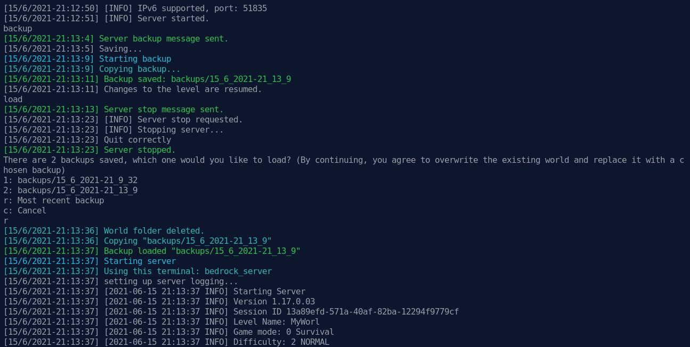

# BedrockServer2000

A linux command line Minecraft Bedrock server wrapper

_Some part of the source code were taken from my other repository (<https://github.com/BaoUida2000/minecraft-bedrock-server-manager>) which was forked from Benjerman's Minecraft Server Manager (<https://github.com/Benjerman/Minecraft-Server-Manager>)._

## Construction in progress

This software is still in development process and hasn't been tested so don't expect it to work.

## Screenshots

