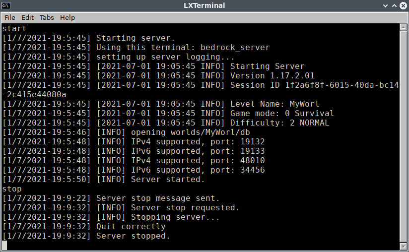
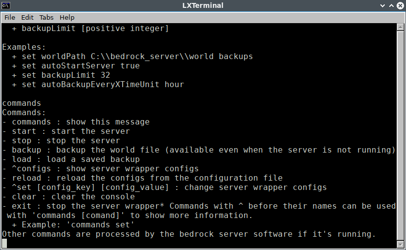
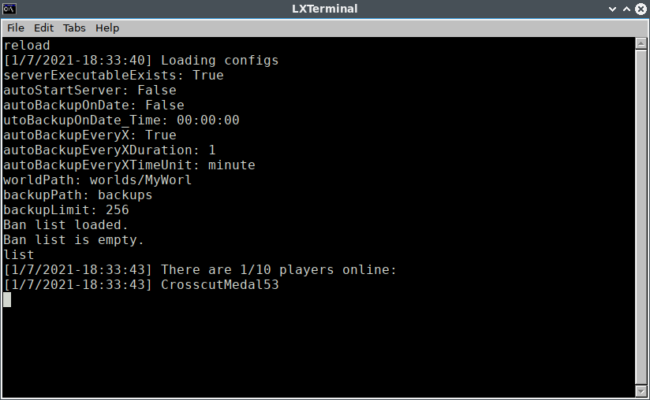
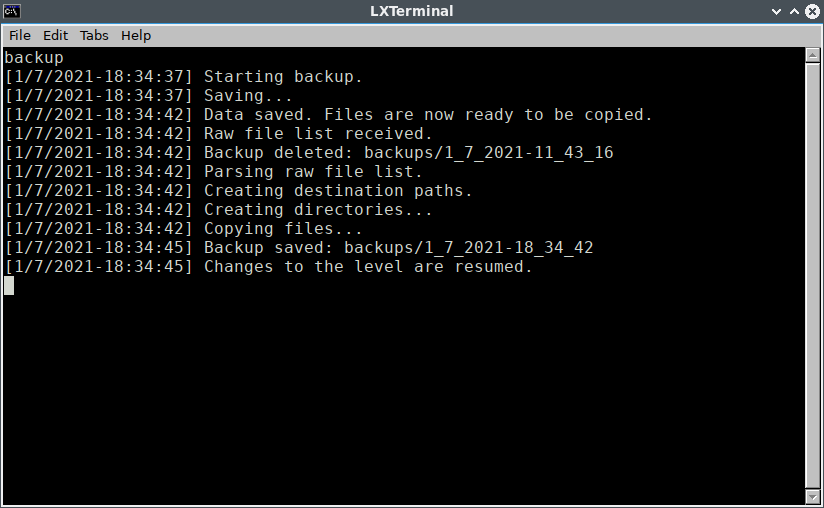
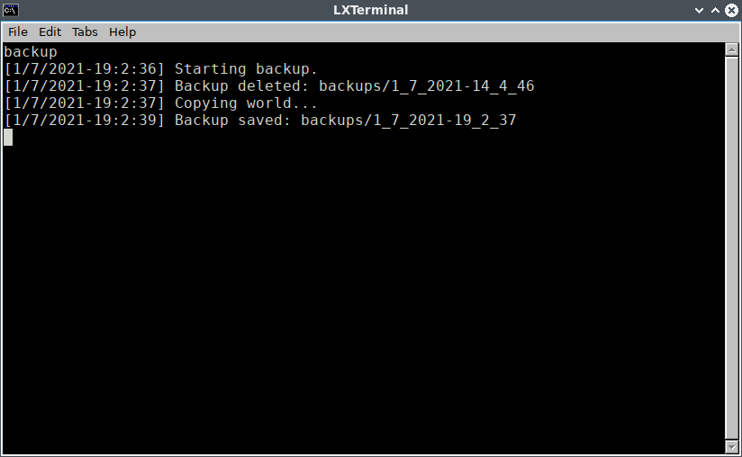
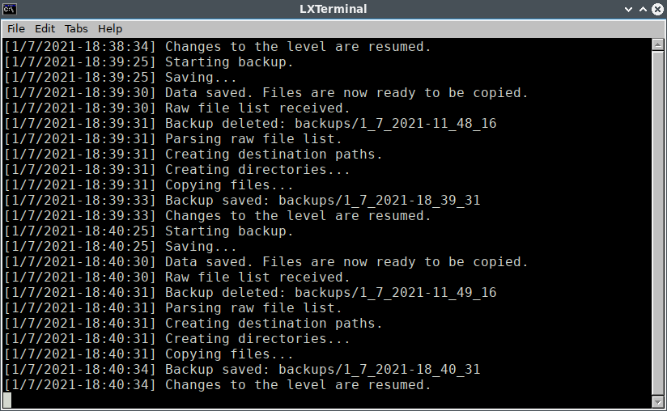

# BedrockServer2000

A cross-platform command line Minecraft Bedrock server wrapper (supports Windows 10 and Ubuntu 18.04)

_Some small parts of the code are based on my other repository (<https://github.com/BaoUida2000/minecraft-bedrock-server-manager>) which was forked from Benjerman's Minecraft Server Manager (<https://github.com/Benjerman/Minecraft-Server-Manager>)._

## Construction in progress

This software is still in development process, some features haven't been implemented and there are lots of bugs so don't expect it to work perfectly.

## Features

### Current features

- Server stop message to let players know that the server will close in 10 seconds
- Automated backup saving, loading and other automated functions (has major bugs)
- Server exit timeout (automatically kill the server process if its exit procedure takes more than 30 seconds)
- Ban list (has minor bugs)

### Unimplemented features

- Automatic backup on DateTIme
- Logging
- Chat logging
- Better exception handlers

## Known bugs

- Exception thrown when ban list file is not found.
- Online backups when loaded will cause missing files issues (temporary solution: overwrite world folder when loading a backup without deleting the world folder first).

## Screenshots

### Misc

Server start/stop

Commands

Configs

### Automated backups saving/loading

Online backup

Offline backup

Automatic backups
